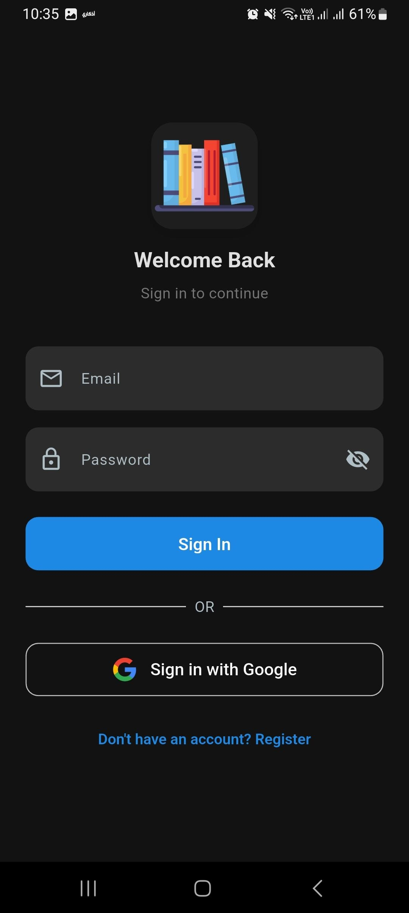
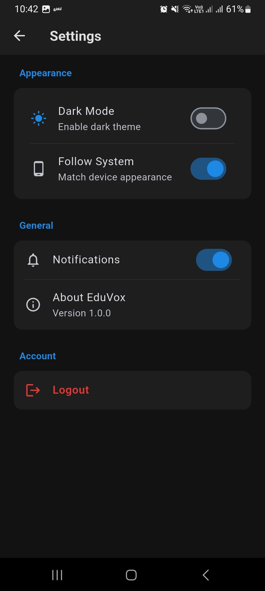
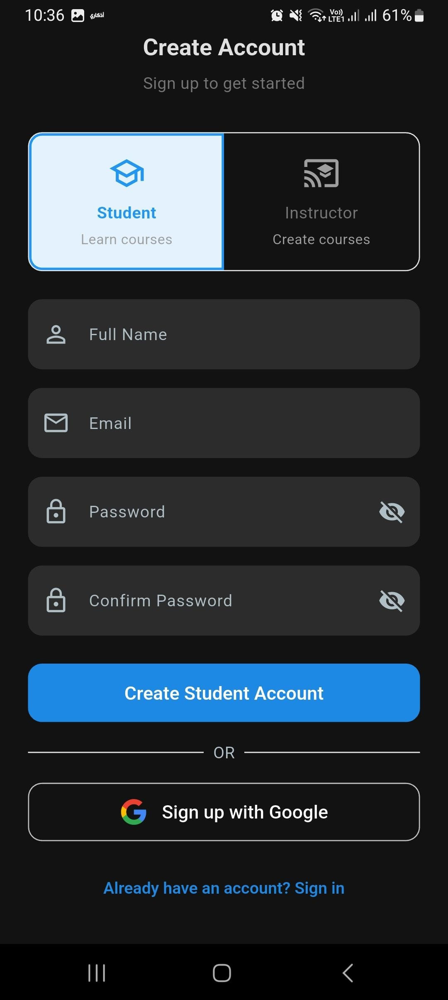
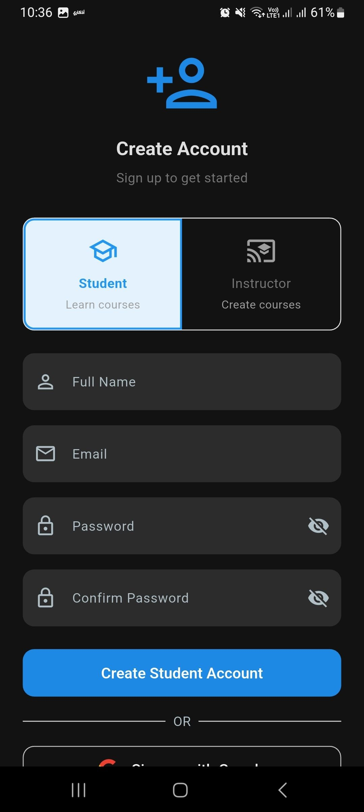
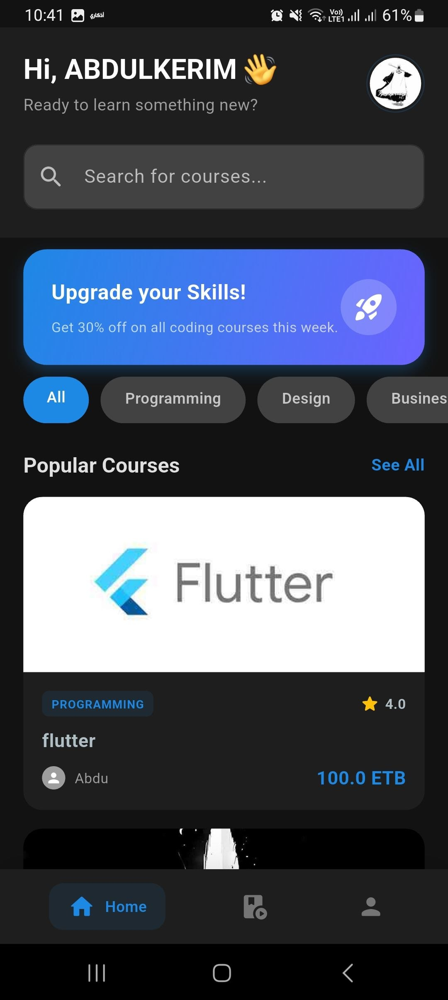
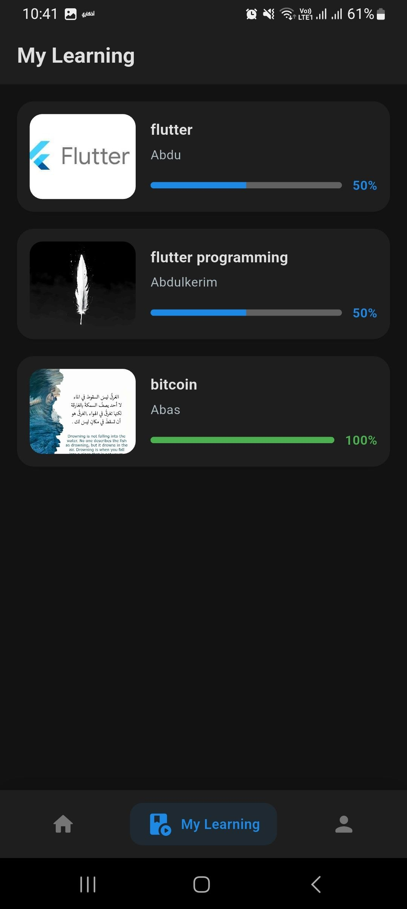

# 🎓 Eduvox - Educational Platform

A full-stack Flutter mobile application enabling users to explore courses, manage authentication, and process payments seamlessly.

## ✨ Features

- **📚 Course Browsing** – Explore and filter courses by category and interest
- **👤 User Authentication** – Secure login/registration with email verification
- **💳 Payment Integration** – Integrated Chapa payment gateway for course enrollment
- **📱 Responsive Design** – Optimized UI for seamless mobile experience
- **🎯 Student Dashboard** – Personalized course recommendations and progress tracking

## 🛠 Tech Stack

**Frontend:** Flutter, Dart | **State Management:** Provider/Riverpod | **Backend:** Firebase  
**APIs:** Chapa Payment Gateway | **Design:** Material Design 3

## 🎯 Key Accomplishments

- Implemented role-based UI (Student/Instructor dashboards)
- Built secure authentication flow with token management
- Integrated third-party payment gateway with error handling
- Designed scalable data models for courses and users
- Created responsive layouts for multiple screen sizes

## 🚀 Quick Start

```bash
git clone <repository-url>
cd eduvox
flutter pub get
flutter run
```

## 📚 What I Learned

- Advanced state management patterns in Flutter
- RESTful API integration and error handling
- Payment gateway integration best practices
- Clean architecture and separation of concerns
- Responsive design principles for mobile apps

## 🔮 Future Enhancements

- Real-time notifications for course updates
- Video streaming integration for course content
- Advanced analytics dashboard
- Offline content caching

## 📸 Screenshots

<a href="assets/images/screenshots/home_page.jpg">
  
</a>
<a href="assets/images/screenshots/instrucor _page.jpg.jpg">
  
</a>
<a href="assets/images/screenshots/setting.jpg">
  
</a>
<a href="assets/images/screenshots/sign_in.jpg">
  
<a href="assets/images/screenshots/sign_in1.jpg">
  
<a href="assets/images/screenshots/student_page1.jpg">
  
<a href="assets/images/screenshots/student_page2.jpg">
  
</a>

## 🌐 Live Demo & Downloads

- **[Live Web Demo](add-your-web-demo-link-here)**
- **[APK Download](add-your-apk-download-link-here)**
- **[Demo Video](add-your-youtube-video-link-here)**

## 👤 Author

**Abdulkerim Adem**  
[GitHub](https://github.com/yourusername) | [Email](mailto:abdulkerimadem453@gmail.com)
